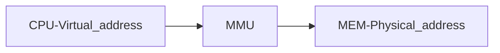

> 노션으로 작성된 글을 백업 용으로 옮긴 것입니다. 개인적으로 공부하며 작성된 글이기에 틀린 정보가 있을 수 있습니다

# Background

## - 배경 지식

- Program 을 실행하기 전 disk 에서 memory 로 가져온 다음에 ‘process’ 로 배치
- Main Memory & Register : CPU 가 직접 acces 할 수 있는 storage
    - Register : 접근하는데는 1 CPU clock (CPI) 이하로 걸림
    - Main Memory : 접근에는 많은 cycle 이 필요 → data 를 주고 받기 위해선 cpu 와 memory 간에 bus 를 통해야해서
        
        → Processor 에 data가 없는 동안 기다려야하게 되기에 Cache 사용할거에요 ㅇㅇ
        
- Cache : Main Memory 와 CPU Register 사이에 존재
- 올바르게 operation 되기위해 Memory Protection 은 필요함
    - User process 로부터 OS 보호
    - User process 서로간의 보호
    - Hardware 에서 제공해줘야합니당

## - Base and Limit Registers

- User process 서로 간의 보호를 위하여 process 가 별도의 memory 공간을 가지게 함 → concurrent execution (동시에 실행)도 가능
- Process 가 access 할 수 있는 legal address 범위를 정하고, 해당 legal address에만 access 할 수 있도록 보장해야함
- Base, Limit 이라고 불리는 두 Register 의 한 쌍이 logical address space 를 정의
    - Base Register : 가장 작은 legal *‘physical’* address
    - Limit Register : 지정된 Range 크기
- OS 만이 이 두 Register 값을 바꿀 수 있음 → 즉 OS 가 제공하는 보호 기능

### [Base & Limit Registers 로 Hardware address protection]

- CPU Hardware가 User mode에서 생성된 모든 address를 Register (base & limit) 과 비교하는 것으로 momory space 보호 → legal address 인지 확인
- User mode에서 실행 중인 prgram OS 나 다른 User 의 momory 에 접근하려는 등 illegitimate memory 에 접근하려고 하면 trap 발생
- address 가 `[base, base + limit)` 에 속해야함

 Hardware address protection with base and limit registers 

## - Address Binding

- Disk에 저장되어있는 Prgram(process) 들은 실행되기위해 Memory 로 가져와지기를 기다리고 있는데, 이때 **input queue** 에서 기다리고 있음
    1. Input Queue 에서 한 process 선택
    2. Disk 에서 Memory 로 Process Load
    3. Process 실행되면 Memory 에서 Instruction 와  data에 접근하여 읽어옴
    4. 실행이 종료되면 Memory 는 다른 process 들이 사용할 수 있도록 Memory space 는 availavle 이라고 decleared

→ 이 처럼 User prgram 은 실행되기 전에 여러 단계를 거침

- user process 가 physical memory 의 어느 부분에 위치해도 상관 없음 꼭 시작부분부터 시작할 필요 없음

### [Multistep processing of a user program]

- Prgram 이 실행되기 위해 여러 단계를 거치는 것으로 이 과정에서 address 를 binding 함
- User program (Source Program) 의 address 는 X 와 같이 **symbol address** 로 표시 됨
- compiler 는 일반적으로 이런 **symbol address**를 “module의 시작으로 부터 14 byte (= 상대경로)” 와 같은 **relocatable address** 로 binding
- Liker (Likage editor) 또는 Loader가 **relocatble address** 를 “74014” 과 같은 **absolute address** 로 binding
- 다음 3가지 stage 에서 Memory address에 대한 binding 이 일어날 수 있음
    1. Compiler time : compile time 에서 Memory 가 어디에 위치할지를 먼저 알고 있다면, absolute code (compiler code) 를 생성할 수 있음
        - process가 R 에서 시작한다는 것을 알고 있다면, code 는 R 에서 시작하여 그 위로 확장됨
        - 시작 위치가 변경된다면 무조건 code를 recompile 해야함
    2. Load time :  compile time 에서 Memory 가 어디에 위치할지를 모른다면, 반드시 compiler 는 relocatable code 를 생성해야함
        - 최종 binding 은 load time 동안 지연됨
        - 시작 위치가 변경된다면 user code 를 다시 load 하여 변경된 값 반영
    3. Execution time : process 가 실행 중에 memory segment 에서 다른 segment 로 이동할 수 있는 경우 binding 은 run time 동안 연기되어야함
        - Address maps 에 대한 Hardware의 도움이 필요함 → Base & Limit register

→ 효과적으로 구현하기 위한 방법을 알아볼거에여

## - Logical vs Physical Address Space

- 별도의 Physical address space 로 binding 된 Logical address space
- **Logical address**  : CPU 가 생성, virtual address 라고도 함 (execution-time 에선?)
- **Physical address** : memory unit 에서 볼 수 있는 address
- **Compile-time & Load-time address-binding scheme** (compile-time 과 load-time 에서의 binding 에선) :
    - Logical address 와 Physical address 동일하게 생성됨 → 주소가 고정적으로
    - memory 에 load 될 때 마다 binding 해줘야함
- **Execution-time address-binding scheme** (Execution-time 에선) :
    - Logical(virtual) address 와 Physical address 다르게 생성됩니다 → 주소가 동적으로 할당
    - MMU 가 매팡 해줘야함
- **Logical address space**  : program 이 생성한 모든 logical address 의 집합 (logical address + mapping 되는 physical address ?? 정보?) → 각 process 마다 가지고 있음
- **Physical address spaece** : physical memory address 의 집합 → process 간 공유 !

## - Memory-Management Unit (MMU)

- 메모리 관리
- Virtual address → Physical address 로 mapping 기능도 있는 Hardware device
- Base Register 를 일반화한 MMU schme 으로 설명하고 여기선 Base Register를 이제 Relocatioin Register 라고 부름
- Relocation register 값은 user program에 의해 생성된 모든 address 에 추가되어 memory 에 전송됨 → (base + addr)
    - ex) 베이스가 14000에 위치한다면
        
        사용자가 주소 0을 지정하려고 할 때 해당 주소는 동적으로 위치 14000으로 재배치
        
        위치 346에 대한 접근은 위치 14346으로 
        
- User program 은 logical address만을 다루고 실제 physicla address는 절대 안봄 (절대 다루지 않음)
- 2가지 type 의 address
    - 0 to Max 인 logical address
    - R+0 to R+Max 인 Physical address (base == R 인 경우)
    

Dynamic relocation using a relocation register

## - Excutable Files

- OS 는 executable file 이 특정 format 을 가질 것이라고 expect
    - Header Info
        - Code Locations
        - Data Locations
    - Code & Data
    - Symbol Table
        - User program 에서 정의된 것들의 이름 list와 해당 위치들(정의된 곳)
        - User program 에서 사용하는 항목들 중 외부에서 정의된 항목들의 이름 list와 해당 위치들(정의된 곳)

## - Two-step operation (in most systems)

- Linking : Library routine 을 포함한 program set을 결합하여 loadable Image 를 생성
    - Set 내에서 정의된 Symbole resolving
    - Loader 가 resolving 해야하는 symbol list화
- Loading :  loadable Image 를 메모리로 복사하고, 이미 load된 다른 program 연결하여 주소를 필요에 따라 업데이트

## - Linking

- Static Linking :
    - Modules 과 사용하는 library들을 포함하여 program copy
    - 여기선 모두가 standard 라이브러리 (libc.a, 등) 를 link 함
    - 그렇다보니 모든 executabe image 와 모든 runtime 에 있는 process 의 memory 공간을 사용하게 됨 ㅜㅜ
    - standard 라이브러리처럼 공통 라이브러리는 공유할 수 있지 않을까?
- Dynamic Linking :
    - Execution time 까지 linking 연기
    - 각 library routin 을 reference 하기 위해 이미지를 포함하는 작은 코드 조각인 **Stub** 사용
        - 적절한 memory-resident (메모리 상주) 라이브러리 루틴을 찾거나 라이브러리가 not present (상주해 있지 않다면) 하다면 라이브러리 load 하는데 사용
    - Stub 은 자기 자신을 해당 routine 의 주소로 바꾸어서 routine 실행시킬 수 있도록 (라이브러리 사용할 수 있게)
    - Dynamic Linking은 Library 에 특히 유용함!
    - 이러한 System 은 **Shared libaries** 라고도 알려져 있음

## - Loading

- Static loading : Program memory 로 compiled & linked image 가 이동
- Dynamic loading :
    - 호출되기 전까진 routine load 안됨 → 모든 routine 이 relocatable load format 으로 disk 에 유지
    - memory-space utilization 측면에서 더 좋음 ! → 사용하지 않은 routine 은 절대 load 되지 않으니까
    - 자주 발생하지 않은 사례를 처리하기 위해 많은 양의 코드가 필요한 경우에 유용함!
        - ex) error routines → error 는 자주 발생하지 않는데 발생해서 처리하려면 많은 양의 코드가 필요하니까

# Swapping

## - Swapping

- 원래 process 를 실행하려면 memory 에 실행할 process의 instruction 과 data 가 있어야하지만,  process를 일시적으로 memory 에서 backup storage 로 swap 한 다음(Swap out), 계속 실행하기 위해 다시 memory 로 가져 올 수도 있음 (Swap in)
- 모든 process의 total physical address space이 실제 시스템의 physical memory 를 초과할 수 있도록 허용하여 시스템에서 degree of multiprogramming 를 증가
- Backup Storage : 모든 user 의 모든 memory copy 본을 수용할 수 있을만큼 충분히 크고 빠른 disk
- ex) Multiprogramming with RR
    1. Quantum 시간이 지나면 process 끝나자마자 swap out
    2. 다른 process 를 swap in 해서 memory space 에 넣음
    3. 이때 schduler 는 memory 에 있는 다른 process 에게 time slice 를 할당
    
    → 이를 통해 프로세스 간 공유 메모리 자원을 효율적으로 관리하면서 실행을 지속 가능
    

- Roll out, Roll in
    - swapping 변형으로 Priority-based scheduling 알고리즘에서 사용되는..?
    - priority 가 낮은 process 를 swap out 하여 priority 가 높은 process 를 load 하고 실행할 수 있도록!
- System 은 memory image가 disk 나 memory 에 있는 모든 ready-to-run process 들의 **ready queue** 를 유지
    - 만약 Ready Queue 내의 다음 process가 memory 에 없다면? → memory 에 있는 다른 어떤 process 를 swap out
    - 이전에 점유했던 space 말고 다른 memory space로 swap back 할 수 있나요? → 넹 !
- Swap time 의 대부분은 Trasfer time (data 가져오는 시간) 임 → swapping 은 expensive 해욤
    - total transfer time 은 swap 되는 memory 양과 직접적으로 비례함
    - ex) backout store 이 trasfer rate 가 50MB/s 인 disk 일 때, 100MB process 의 transfer time 은? → 2초! → 1Ghz CPI 인 경우 2*10^9 CPU cycle 이 됨

# Contiguous Memory Allocation

## - Memory Allocation

- 일반적으로 main memory 는 2개의 partition 으로 나뉨
    1. Resident Operating System (상주하는 OS) → system 마다 다르긴 한데 일반적으로 interrupt vector 와 함께 low memory address 에 보관
    2. User process → high memory address 에 보관
- process 에 사용 가능한 moemory 를 할당하는 방법
    - 일반적으로 여러 user program 을 main memory 에 상주시키고 싶음 → 그래야 multiprogramming 정도가 높아져 빠르니까
    - 그래서 할당하는 방법을 고려해야함 !
    - contiguous allocation : 각 process는 단일 contiguous section (memory의) 에 포함됨

## - **Memory Protection**

- User process가 자신에게 할당되지 않은 memory 에 접근하지 않도록 해야함 ! ← process간 서로 보호하고 OS의 code 와 data 를 변경하지 못 하도록 보호해야하니까
- Relocation Register 와 Limit Register 사용 !
- Relocation Register : physical address 의 가장 작은 값 포함
- Limit Register : logical addresses의 범위 포함 → 각 logical address는 limit register 보다 작아야함
- MMU : Logical address 를 dynamically 하게 mapping → 위에서 말한 유닛 .. ! 여기서도 사용되어요

## - Partition scheme

- Partition : 하나의 Memory 를 logical 하게 나눔
    - 나누어진 partition 은 각각 독립적으로 관리될 수 있으며 각 partition 에는 file system 이 할당 됨
    - 각 partition 은 딱 하나의 process 만 포함할 수 있음
- Fixed Partition scheme
    - Disk를 미리 정해진 크기의 Partition 들로 나누고, 각 partition 의 크기는 동일한 고정된 크기를 가지고 있음
    - Partition 수에 따라 Degree of Multiprogramming 이 제한 → partition 도, partotion 의 크기도 고정이니까
    - Internal fragmentation 발생 가능
- Variable Partition scheme
    - Load 된 program 크기에 따라 partition 크기 결정
    - External fragmentation

## - Memory Allocation (in Variable Partition scheme)

- Hole : 사용가능한 memory block
    - 처음엔 모든 memory 가 user process에 대해 사용가능하므로 큰 하나의 hole 임 !
    - 나중에는 다양한 크기의 hole 들이 memory 전체에 흩어져 있고 이들은 hole set 에 있음
- process가 도착하면
    1. system 은 이 process 를 할당할 hole 찾기 위해 hole set 탐색
    2. memory의 수용할만큼 큰 hole 에 할당
    3. hole 이 너무 큰 경우 2개의 part 로 나뉘어 하나는 process에게 할당, 하나는 다시 hole set에 return
    4. 그리고 terminate 되면 memory 에서 해제되고 hole set으로
    
    → spilt and merge
    
- OS 는 다음 정보를 유지
    - allocated partitions
    - free partitione (hole) ( == free space == free address )
- Dynamic Storage-Allocation 이라고도 함

1 → 2 : process 8 해제 ! relase 되고 hole 생김

2 → 3 : process 9 할당 p5 바로 아래 말고 hole 중간에 들어가서 hole 이 2개가 될 수도 있고 암때네 가능

3 → 4 : process 5 해제 ! realse 되고 hole 생김

## - Dynamic Storage-Allocation Problem

- Free hole set에서 size n 인 요청을 어떻게 충족시킬 것인가 에 대한 문제 → 사용가능한 Hole set 에서 free hole 고르는 방법
1. First-fit : 충분히 큰 크기를 갖는 첫번째 hole 할당 → 탐색하다 충분히 큰 hole 발견하면 중지하고 할당하고 끝
2. Best-fit : 충분히 큰 크기를 갖는 hole 중에 가장 작은 것 할당
    - size에 대해 정렬되어 있지 않다면 전체 list를 다 봐야함
    - 가장 작은 leftover hole (찾은 hole 할당 후 남은 부분) 생성 → 할당 후 남은 hole 을 최소화
3. Worst-fit : 가장 큰 hole 할당
    - 전체 list 다 봐야함
    - 가장 큰 leftover hole 생성
- 시뮬레이션 결과 속도 및 storage 활용 측면에서 First-fit 과 Best-fit이 Worst-fit 보다 우수하다고 보여줌

## - Fragmentation

- 영역이 작은 조각으로 잘리는 단편화 문제
- First-fit, Best-fit 모두 external fragmentation 문제를 겪음
- memory 가 낭비되는 문제 ㅠㅠ
- External Fragmentation :
    - process가 memory에 load 되고 remove 됨에 따라 free memory space 가 작은 조각들로 나뉘어지게 됨
    - 이러한 과정에 의해 Total memory space 는 요청을 만족시킬 정도로 충분하지만, 연속적이지는 않을 때 External Fragmentation 발생
    - 그니까 할당 할 수 있을만큼 memory 가 충분한데 그게 작게 나뉘어져 있어서 할당을 못 하게 되는,, → memory 낭비 문제
- Internal Fracmentation
    - 일반적으로 memory 를 고정된 크기의 block 으로 나누고, block 단위로 memory에 할당함
    - 할당된 memory 가 요청한 memory 크기보다 클 수 있음 (고정된 크기로 나누다 보니까) → 남은 공간은 partition 내부의 memory 지만 사용하지는 않음!
    - 이때  Internal Fragmentation 발생하고 이 차이가 Internal Fragmentation
    - ex) 고정 사이즈가 4KB 인데 요청 사이즈나 2KB 인 경우 2KB 만큼이 internal fragment
- 해결 방법
    1. Compaction
    2. Process의 Physical address space가 비연속적이게 할당할 수 있도록 허용 (Non-Contiguous memory allocation 방식 사용)
        1. Paging
        2. Segmentation

### [compaction]

- External fragmentation 줄일 수 있는 해결방법
- memory 내 free space 들을 보아 하나의 큰 block 으로 만드는 것이 목표
- Only Relocation 이 dynamic, 즉 execution time에 binding 이 될 때만 가능 !! → 즉, 항상 가능한 것은 아닙니다요
    - Relocation 이 dynamic : Relocation 은 program 이랑 data 가 옮겨지거나, base register 가 새로운 base address로 변경 될 때만 필요함

**ex) Simplest Compaction Algorithm**

- 모든 process 들을 memory의 한쪽 끝으로 옮기는 동안 모든 hole 들을 다른 방향으로 이동시킴 (process를 top 으로 올린담에 free 를 bottom 으로 모아버리는,,)

### [Process의 Physical address space가 비연속적이게 할당]

- Physical address space가 비연속적이게 할당할 수 있도록 허용함
- 그럼 작은 조작에도 할당 할 수 있게됨 !
- 이 방법에는 Paging, Segementation 두가지 방법이 있어요
    - paging : physical memory 를 page 로 나누고 이 page 들을 process 에게 할당
    - segmentation : program 을 segment로 나누고 각 segment 들을 memory 에 할당
    - 자세한 차이점은 밑에 적어놨움

# Paging

## - Paging

- Process의 physical address space가 비연속적이 되어도 괜찮다고 허용 → non-contiguous allocation
- External fragmentation을 피할 수 있고 compaction 도 필요없게 됨
- physical memory 를 **고정된 사이즈**의 block 인 frames (== pysical pages) 로 나눔
- logical memory 를 frames과 동일한 크기의 block 인 pages (== virtual pages) 로 나눔
- 모든 free frames 추적
- n page 크기의 program 을 실행하려면 n 개의 free page 를 찾아 load 하면 됨 !
- Logical address 가진 page 를 physical address 가진 page (frame) 로 변환하는 page table 필요 !
- Internal fragmentation 가 발생하긴 함,,, → 고정 크기다 보니까 . .

## - Address Translation Scheme

- CPU 에서 생성된 address 들(logical, physical)은 2개 영역으로 나뉨
- Page numper (p) : physical memory 에서 각 page (physical page, frame) 의 base address 를 포함하는 **page table 의 index** 로 사용
    - virtual 인지 pyshical 인지 확인하는 용도로 사용되기에 이 둘을 나눠야한다??
- Page offset (d) : base address 와 결합하여 memory unit 으로 전송되는 memory address

- Page size 는 HW 에 의해 정의되며, 512 byte 에서 16MB 범위 내의 2의 거듭제곱 크기로 정의
- ex) Logical address space 가 2^m 이고, page size 가 2^n 이라면 상위 (m-n) bits는 page number, 하위 n bits 는 page offset
    
    

    
    

    

### [example. n=2, m=4] **** 무조건 시험 !**

- Page size == frame size = 4 ( $2^n = 2^2$ ) bytes
- Page number =  $2^{(m-n)}$ = 4 개
- Logical Address space size = 16 ( $2^m = 2^4$ )
    - Logical memory size = 4 bytes * 4 pages = 16 bytes
    - page number : 2 bits
    - page offset : 2 bits
- Physical Address space size = 32
    - Physical memory size = 32 bytes (8 frame * 4 bytes)
    - page (frame) number : 8 frames → 3 bits
    - page offset : 2 bits
- **Logical address 0 의 경우**
    - 0000 이므로 page number 은 00, page offset 은 00
    - page table index 0 번째 값은 5 임! (frame 5)
    - physical memory 5 * 4 bytes 로 이동 후 offset 이 0 이므로 physical address 20 으로 mapping
- **Logical address 7 의 경우**
    - 0111 이므로 page number 은 01, page offset 은 11
    - page table index 1 번째 값은 6 임! (frame 6)
    - physical memory 6 * 4 bytes 로 이동 후 offset 이 3 이므로 physical address 27 으로 mapping

## - Fragmentation in paging

- External fragmentation 없음 ! → 요청하는 process 에게 어떤 빈 frame 이든 할당해줄 수 있음
- Internal fragmentation 은 있어요.. → 고정 크기의 frame 단위로 할당해주다보니 어쩔 수 없죠
    - frame 단위로 할당해주다보니 마지막으로 할당한 page 내부에서 다 채워지지 않은 경우 internal fragmentation 이 발생할 수 있음
    - 최악의 경우 : process 가 (n pages + 1) byte 를 요청하는 경우 (n  + 1) frames 을 할당해주어야하고  마지막 frames 는 거의 전체가 internal fragmentation 이 됨
- page size 가 작다면 internal fragmentation 을 줄일 수 있음! 하지만 그 만큼 각 page table 항목에 대한  overhead 는 증가 (frame 수가 증가하니까)
    - page table 에 대한 overhead 는 page size가 증가할 수록 줄어들어요
- Efficition ?? = (n*s+1)/(n+1)*s
- 32 Bit page table entry 의 경우 page table 이 허용할 수 있는 page number (frame number) 는 ? → 2^32 개
- 만약 이때 page/frame size 가 4KB 라면 system 이 처리할 수 있는 physical memory 크기는? 2^32 * 4 KB = 2^44 bytes

## - Free Frames

- process 가 실행하기 위해 n 개의 page 가 필요하다면 최소 n 개의 free frame 이 memory 에서 available 해야함
- OS 는 반드시 physical memory 의 세부정보를 알아야함
    - allocate 또는 available 한 frame 을 추적!
    - 어떤 frame 이 할당되었고, 어떤 frame 이 사용가능한지, 총 frame 은 몇개인지 등
- process 가 실행되기 위해 system에 도착하면 page 단위로 표현된 크기를 검사하고 각 page 는 하나의 frame 필요
- 즉, process가 n개의 page를 필요로 한다면, 최소 n개의 free frame 이 memory 에서 available 해야하고, 가능하다면 process 에게 할당
- process의 첫 번째 page는 가능한 frame 중 하나에 load되고, 해당 process의 page table 에 frame 번호가 입력
- 다음 page는 다른 frame에 로드되고, 그 frame 번호가 page table 에 입력되는 식으로 진행
- 즉, process 의 page table 에 page 와 mapping된 frame number 가 들어있음

 Free frames (a) before allocation and (b) after allocation. 

## - Implementation of Page Table with Hardware’s support

- page table 의 pointer 는 다른 register values (ex instruction pointer) 과 같이 각 PCB 에 저장됨
- Scheduler 가 process 선택할 때 page table 을 변경해야하므로 pagine 방법은 context switch 시간이 증가시킴
- 이러한 page table 을 위해 (context switch 시간을 줄인다던가) 도입된 HW 의 지원들
    1. PTBR
    2. TLB
    3. ASID

### [Page-table base register (PTBR)]

- Page-table base register (PTBR) 은 page table 을 point 하는 reg
- page table 변경하려면 PTBR 만 변경하면 되기에 context switch 시간을 줄일 수 있음
- 하지만 이 방식은 더 memory 접근 시간이 더 느려질 수 있음 → 모든 data / instruction 접근하기 위해 2번의 memory 접근이 필요
    1. PTBR를 통해 page table 에 접근
    2. page table 에서 number 에 따라 frame 으로의 data / instruction 접근

### [translation look-aside buffers (TLBs)]

- PTBR 의 memory 두번 접근하는 문제 해결
- 특수한 작고 빠른 조회용 hardware chach 로 associative 한 high-speed memory 임
- 각 항목은 key와 value 두 부분으로 구성
- associative memory 에 값이 주어지만 주어진 key (page #)를 모든 key 들과 동시에 비교하면서 병렬적으로 content 를 검색함
- TLB : `Address translation(p, f)`
    - p 가 TLB 에 있다면 frame number f 를 얻어 전달
    - 없다면 page table 에서 frame number 찾아서 전달

### [A**ddress-space identifiers (ASIDs)**]

- TLB 기반
- 일부 TLB 는 TLB 항목에 **address-space identifiers (ASIDs)** 도 저장함
- **ASID :** 어떤 process가 이 page 와 frame 을 쓰고 있는지 각 process 를 고유하게 식별해서 해당 process 에 대한 address space 보호를 제공하는데 사용
- TLB 이 locigal page number 를 확인하려고(찾으려고?) 할 때 현재 실행중인 process 의 ASID 가 page 와 관련된 ASID 와 일치하는지 확인 → 일치하지 않다면 TLB miss
- ASID 를 통해 TLB 는 서로 다른 process에 대한 항목을 동시에 포함할 수도 있게됨 ! → ASID 로 확인하면 되니까 ! → 더 효율적이죠
- 별도의 ASID 를 지원하지 않는다면 context switch 마다 TLB 를 flush (삭제) 해야해서 유효하지 않은 주소가 남아있지 않도록 해야함

### [Effective Access Time]

- Time for associative lookup: **ε**
- Time for memory access: **t**
- Hit ratio : **α**
- **Effective Access Time**
    1. page number 가 TLB에 있는 경우(HIT) :  mapping된 memory 접근 → **t** 
    2. TLB에 없다면(MISS) : page table 과 frame number를 위해 메모리에 접근(**t**), 그 이후 원하는 data 에 접근 (**t**) → 총 **2t**
    - 찾는데 **ε** 가 걸리므로 각 경우 걸리는 시간이 **t + ε,  2t + ε** 이고, **α** 에 따라 가중치를 주면
        
         → **Effective Access Time :  *EAT = (t + ε) α + (2t + ε)(1 – α) = 2t + ε – αt***
        

***ex) t=100ns, ε=20ns, α=0.8***

→ EAT= (100+20)*0.8 + (2*100+20)*0.2=140

## - Memory Protect

- Protection bit : paging 환경에서 memory 보호하기 위해 page table 에 저장되는 각 frame 에 대한 protection bit
    - Read-Write / Read-Only 구별할 수 있는 하나의 bit
    - Read-Only page 에 write 하려고 하면 OS 로 HW trap
- Valid-Invlalid bit : page table 의 각 항목에 저장되는 page 의 유효성을 알려주는 bit
    - Valid : associated page 가 process의 logical address space 에 있기에 legal page → 한마디로 지금 process 에서 해당 page 가 frame 과 연결되어 사용 중이라는
    - Invalid : page 가 process 의 logical address **space** 에 없음
- Page-table length register (PTLR) : page table 의 크기를 나타냄
    - 많은 process 들이 사용가능한 address space 의 일부만 사용함 그렇기에 모든 page 에 대해 page table 항목을 생성하는 것은 낭비임 → page table index < avlid page number
    - PTLR을 모든 logical address 와 비교되어 해당 address가 process 의 유효한 범위에 있는지 확인하고, 유효하지 않은 범위면 OS 로 trap

### [**Ex. 14-bit address space (0 to 16383) with page size 2KB (= 2048 bytes)]**

| page0 | 0 - 2047 |
| --- | --- |
| page1 | 2048 - 4095 |
| page2 | 4096 - 6143 |
| page3 | 6144 - 8191 |
| page4 | 8192 - 10239 |
| page5 | 10240 - 12287 |
- process 는 실제 0 to 10468 만 사용 → page0-4 전부와 page 5 의 일부
- page 0-5 는 valid 이기에 page table 을 통해 정상적으로 mapping
- page 6-7 은 invalid 이기에 page 6, 7 로 address 변환하려는 시도가 있으면 유효하지 않은 page 참조로 OS 로 trap
- ***이 방식의 문제점***
    - process 는 10468까지만 사용하기로 되어있기에 그 이상 접근하면  illegal 임
    - 하지만 page 5 의 참조는 valid 로 되어있기에 12287 까지 address 에 접근하는 건 유효하지만 10469 to 12287 까지의 address 는 유효하지 않음 ㅜㅜ
    - 이건 process 가 실제 사용하는 공간보다 훨씬 큰 2KB page size 에 의해 page 내부에서 internal fragmentation 이 발생한 것
    
    → 즉, 할당된 page 중 일부만 사용하기에 사용되지 않는 부분은 유효하지 않은데 valid 로 되어있음
    

## - Shared Page

- Paging 의 장점 중 하나는 여러 process가 있는 환경에서 common code 를 공유할 수 있다는 점
    
    (reentrant인 code : 여러 user 들에게 사용되는 code 인 경우에서)
    
- Read-only code의 한 copy 본은 여러 process에서 공유될 수 있음 ! ex) 표준 c 라이브러리, text editor, compiler, window system
    - read-only 이니까 (reentrant) 실행 중에 변경되지 않음으로 2개 이상의 process가 동일한 code 를 실행할 수 있음
    - 이때 copy 본은 physical memroy에 하나만 유지되어도 각 user process 의 pafe table 은 동일한 physical memroy 와 mapping 할 수 있음
    - 이 덕에 memory 공간 매우매우 아낄 수 있음

# Structure of the Page Table

## - Large page table problem

- 대부분 현대 컴퓨터 system 은 큰 logical address space (2^32 ~ 2^64) 를 지원하고 이 환경에선 page table 자체가 지나치게 큼
- 32bit logical address space 를 가진 system 에서 page size 가 4KB (2^12) 라면 page table 은 100만개 이상의 entry 로 구성될 수 있음 (2^20 = 2^32/2^12)
- 각 entry 가 4byte 로 구성되어 있다면 각 prcoess 는 page table 만으로도 최대 2^20 * 4 bytes = 4MB 크기의 physical address space가 필요 할 수 잇음
- 이를 main memory 연속적으로 할당하는 것은 비효율 적임 → 비효율적인 이유 개인적으로 찾아서 적어둠
    - mina memory 의 공간 낭비 : 연속적은 큰 공간을 찾아야하므로 낭비되는 memory 공간이 증가함
    - external fragmentation : address space 내에 page table 이 연속적으로 배치되므로 address space 내에서 external fragmentation
    - page table 크기 변경 어려워짐 : process 의 address space 가 동적으로 변할 수 있기에 page table 크기도 동적으로 조정되어야함. 하지만 연속적으로 할당한다면 새로운 공간을 찾아야하니 어려워짐
- 이를 해결하기 위해 page table 을 더 작은 조각 나누는 방법을 사용 !
- Page table Strucutre type
    1. Hieracrchical Paging : Page table 도 page 됨 
    2. Hashed Page Tables : Hash table 사용
    3. Inverted Page Tables : 

## - Hirarchical Page Table

- Logical Address Table 을 여러 page table 로 나눔 → 즉 page table 도 paging 됨
- 가장 심플한 건 2단게로 나누는 2 level page table

### [Two-level Paging example]

- 32 bits system, 4KB (→ 2^12) page size
- Logical address 은 20 bit 로 구성된 page number 와 12 bit 로 구성된 page offset 으로 나뉨
- page table 도 page 되니까 page number 은 또 10 bit 의 page number 와 10 bit 의 page offset 으로 나뉨
- p1 은 outer page table 의 index, p2 는 outer page table 에서의 위치 (displacement)

- 64bits system 에서는 outer page table 이 굉장히 커지게 되므로 two-level paing 이 적합하지 않음

## - Haded Page Tables

- 32-bits 이상의 address space 를 처리하기 위한 일반적은 접근 방법 중 하나는 hased page table 을 사용하는 것
- virtual page number은 page table 에 hash 됨
- Hash table 의 각 entry 에는 충돌을 처리하기 위해 동일한 위치로 hash 하는 element들의 chain (linked list)가 포함 됨
- 각 elemet 는 다음 3가지로 구성
    1. virtual page number
    2. mapping 된 page frame 값
    3. linked list 에서의 다음 element 를 가르키는 pointer
- Virtual page number은 는 이 chain 에서 match 되는 것이 있는지 비교함! 일치되는 것을 찾은면 해당 physical frame 이 추출

1. virtual address의 virtual page number 가 hash table 에 hash 됨
2. virtual page number 는 lisked list 의 첫번째 elem 와 비교
3. 일치하는 항목이 있으면 해당 elem 의 두번째 값 (page frame) 이 사용되어 physical addres 생성
4. 일치하는 항목이 없다면 elem 의 세번째 값 사용해서 linked list 의 다음 elem 과 비교해 일치하는 것 찾기

## - Inverted Page Table

- ex) UltraSPARC, PowerPC
- memory 의 실제 page 에 대한 하나의 entry 를 가짐
- Entry <pid, p>
    - pid : 해당 page 를 가지고 있는 process로 address space 식별자 역할
    - p : 실제 memory 위치가 저장된 page 의 virtual address
1. pid 를 통해 page table 에서 pid 와 일치하는 entry 찾기
2. 찾았다면 entry 의 index 인 i 를 가진 frame와 매칭 ! 이때 p 를  virtual address로 사용
- 각 page table 을 저장하는데 필요한 memory 는 줄어들지만, page 참조시 table 을 검색하는데 필요한 시간은 늘어남
- shared memory 구현이 어려움 → pid 식별자가 있으니 공용에 대해서는?

# Segmentation

## - Segmentation

- memory 에 대한 사용자 관점을 지원하는 memory management scheme
- program을 서로 다른 크기의 logical unit 인 segment로 분할함!  → program 은 segments의 collection임
- segment는 다음과 같은 logical unit
    - main program
    - procedure
    - function
    - method
    - object
    - local variables, global variables
    - common block
    - stack
    - symbol table
    - arrays
    - …

 User’s view 

 Logical view 

## - Segmentation Architecture

- logical address 는 tuple <segment-numer, offset>
- Segment table : 2차원 주소를 1차원 physical address 로 mapping!
    - page table과 비슷하지만 크기가 고정이 아님
- 각 table entry 는
    - base : segment가 memery 에 상주하는 physical address 의 시작점을 포함
    - limit : 지정된 segment 의 길이 → page table 과 달리 크기가 고정이 아니고 process 의 unit 마다 다를 수 있음

## - Segmentation 구현 위해 필요한 HW

- Segment-table base register (STBR) : memory 에서 segement table 의 위치를 point 하는 reg
- Segment-table length (limit) register (STLR) : program 이 사용하고 있는 segments 수 를 나타냄
- segement number s < STLR 일 때 s 는 legal

## -  Protection in segmentation

- segment table의 각 entry associate
    - validation bit가 0 이면 illegal segment
    - read / write / execute 권한
- segment 관련된 Protection bit
- code 는 segment level 에서 공유됨
- segment 길이가 다양하기 때문에 moemory 할당은 storage-allocation problem

### [example]

- limit 인 400 보다 53 이 작기에 ㄱㅊ
- limit 인 1000 보다 1222 가 크기에 trap

## Paging vs Segmentation

- Paging 은 고정 크기, Segmentation 은 가변크기
- Pagine 은 internel Fragmentation 위험성, Segmentation 은 Externel Fragmentation 위험성
- paging 은 고정된 크기의 page로 memory 를 분할하고 logical address를 page로 매핑 → 즉 메모리를 분할 !
- segmentation 은 program을 segment로 분할하고 segment를 physical address에 매핑 → 즉 프로그램을 분할 !